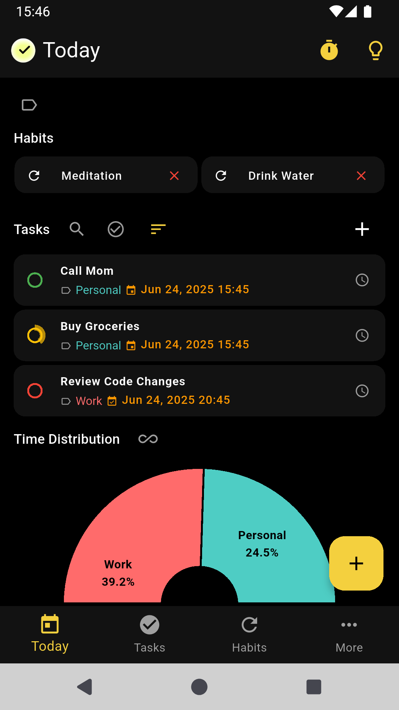
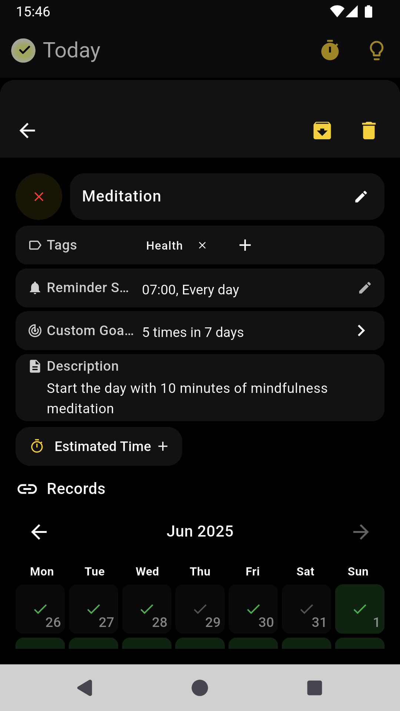
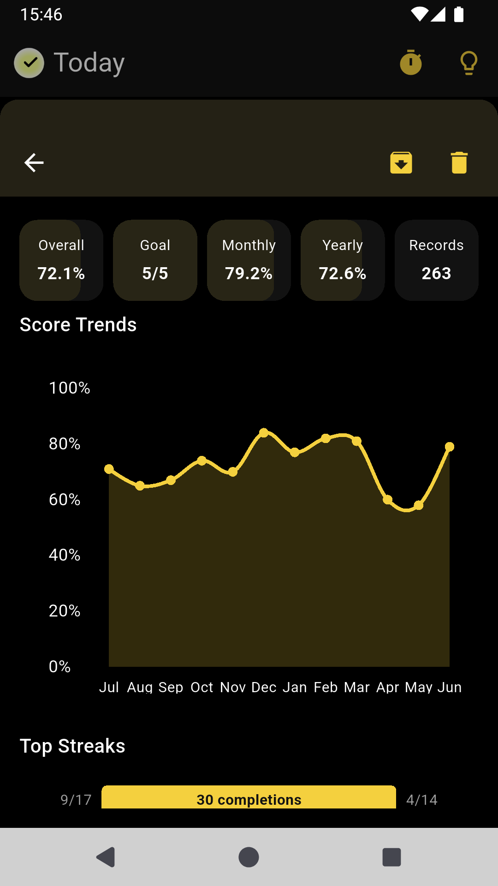
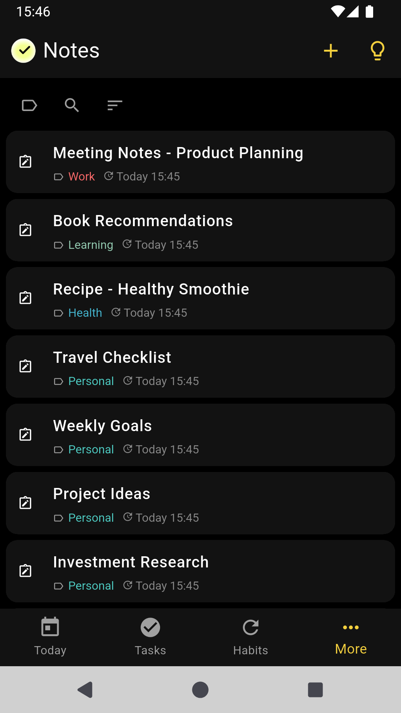
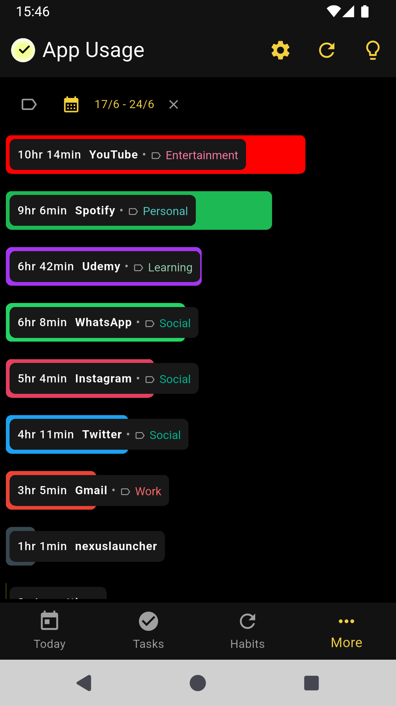
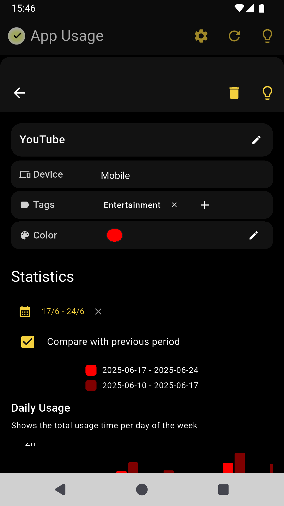
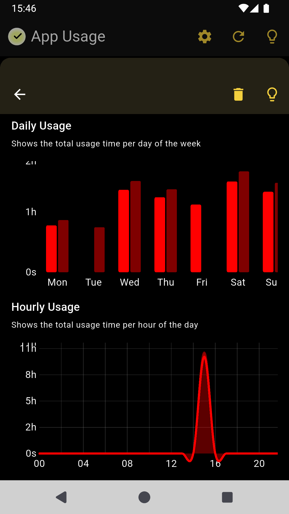
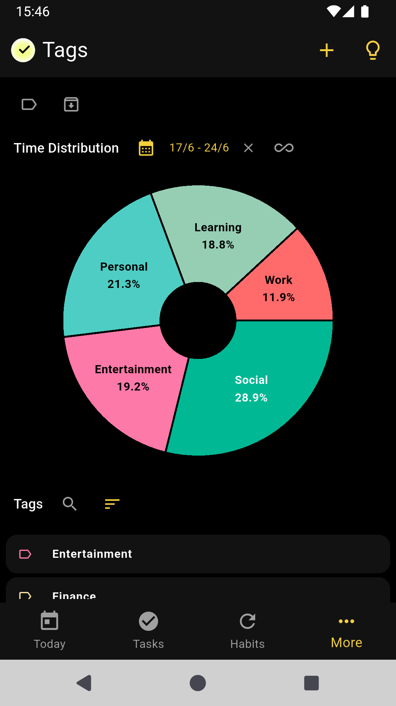
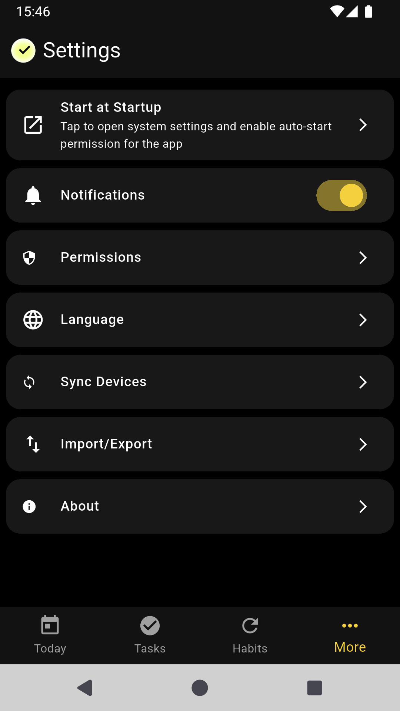

#  WHPH - Work Hard Play Hard   

WHPH is a comprehensive productivity app designed to help you manage tasks, develop new habits, and optimize your time. It tracks application usage to enhance focus, allowing you to analyze your progress, celebrate achievements, and stay motivated.

Available for Android, Windows, and Linux platforms.

  

## ⏬ Installation

You can download the app from the following links:

[&style=for-the-badge&logo=github)](https://github.com/ahmet-cetinkaya/whph/releases)
[&color=1976D2)](https://f-droid.org/packages/me.ahmetcetinkaya.whph)

> For Linux users, please check the [Linux Dependencies Guide](docs/LINUX-DEPENDENCIES.md) to ensure you have all required system libraries installed before running the application.

## 📱 Screenshots

  
  
  
  
  
  
  
  
  
  

## 🤝 Contributing

See [docs/CONTRIBUTING.md](docs/CONTRIBUTING.md) for comprehensive contribution guidelines, including environment setup, code style, pull request process, issue reporting, and testing requirements.
